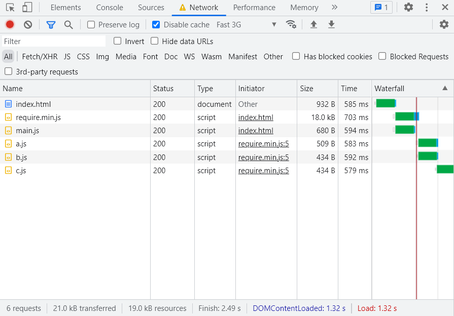
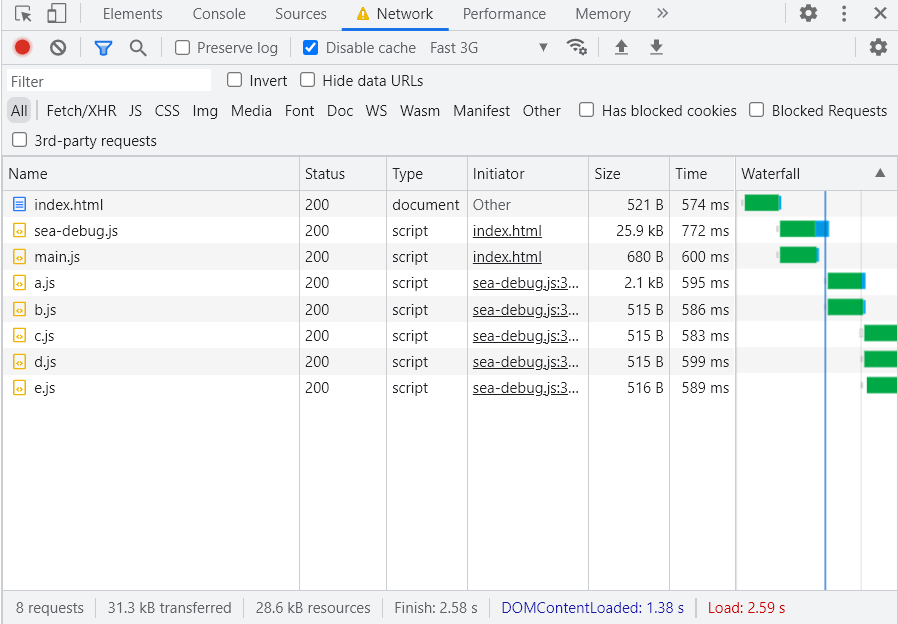
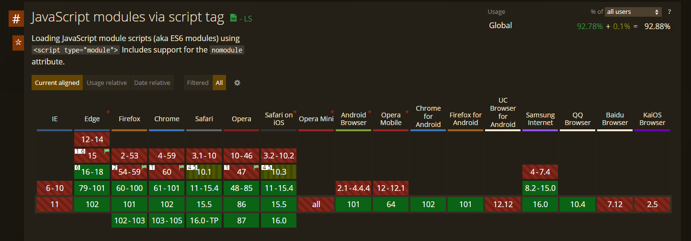
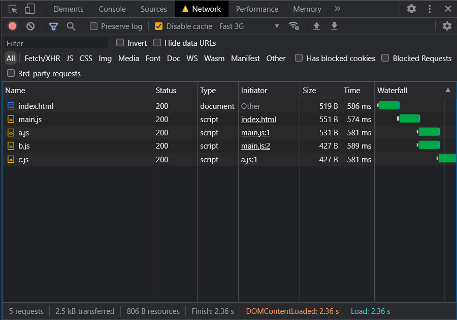
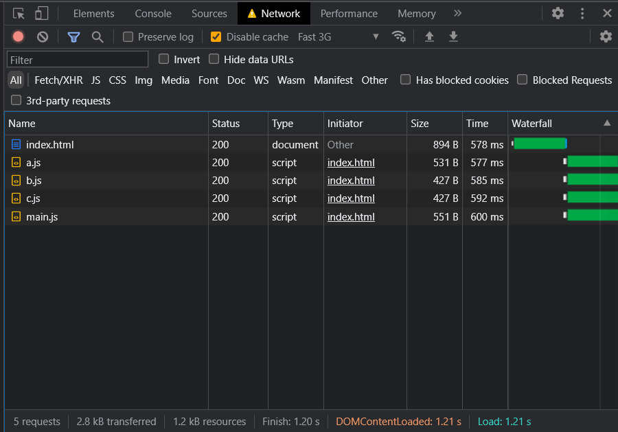
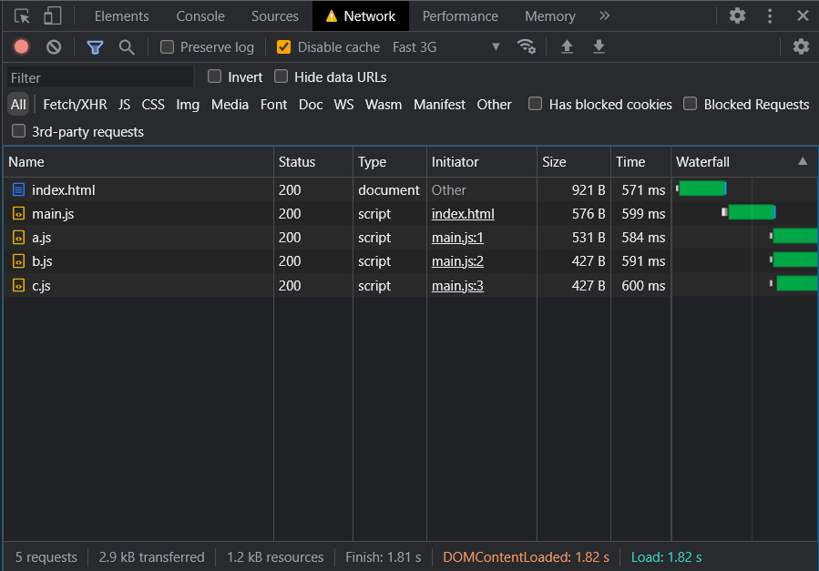

# JavaScript 中的模块化

- [在模块出现之前](#在模块出现之前)
- [Node.js 的崛起和模块化编程在 JavaScript 世界登场](#nodejs-的崛起和模块化编程在-javascript-世界登场)
- [RequreJS 和 AMD（Asynchronous Module Definition）](#requrejs-和-amdasynchronous-module-definition)
- [UMD（Universal Module Definition）](#umduniversal-module-definition)
- [SeaJS 和 CMD（Common Module Definition）](#seajs-和-cmdcommon-module-definition)
- [ESM（ECMAScript Modules）](#esmecmascript-modules)
  - [定义和产生一个 ESM 模块](#定义和产生一个-esm-模块)
  - [使用 `export` 关键字进行模块的接口输出](#使用-export-关键字进行模块的接口输出)
  - [使用 `import` 关键字引入外部模块](#使用-import-关键字引入外部模块)
  - [ESM 实现了真正的模块级作用域](#esm-实现了真正的模块级作用域)
  - [ESM 的输出只读特性和动态绑定（live bindings）特性](#esm-的输出只读特性和动态绑定live-bindings特性)
  - [Top-level `await`](#top-level-await)
  - [ESM 模块的识别、加载、解析/编译和执行](#esm-模块的识别加载解析编译和执行)
  - [预加载 ESM 模块](#预加载-esm-模块)
  - [使用 import() 动态引入模块](#使用-import-动态引入模块)
- [总结](#总结)

## 在模块出现之前

要理解模块在 JavaScript（简称 JS，下同）中的重要性和必要性，就必须回头看下在模块功能出现之前，JS 代码是如何编写以及组织起来的。
起初，JS 语言只是运行在刘浏览上解释执行的脚本语言。在 HTML 代码的 `<script>` 标记内即可完成 JS 代码的编写（行内 JS），例如：

```html
<script>
var a = 1, b = 2;
document.body.innerText = 'a + b = ' + (a + b);
</script>
```

这个阶段，没有前端和 Web 应用程序（WebAPP）的概念，JS 通常比较简单，很多都是直接写在 .asp, .aspx, .cshtml, .php, .jsp, .htm, .html 等具有 HTML 代码功能的文件内的。每次访问一个页面，都会发起网络请求加载页面对应的 HTML 文件，然后继续加载其它所需资源。但是网页上的动态交互的实现主要还是依靠 JS 进行实现，随着网速的提高，网页的共享性、便捷性越来越突出，许多功能都通过网页来实现，交互逻辑也越来越多。JS 代码的量也越来越大，这导致 HTML 内的 JS 代码维护越来越困难。JS 代码的书写、组织管理开始有了新的变化。主要包括：

- JS 代码不直接写在 HTML 类型文件内，而是写在 `.js` 文件内（外部 JS），通过 HTML 的 `<script>` 标记的 `src` 属性引入到 HTML 文件中，浏览器解析 HTML 时遇到有 `src` 属性的 `<script>` 标记时， 就会通过 `src` 属性指定的 URL 加载 JS 文件然后进行解析。多个不同的 HTML 文件可以引入同一个外部 JS 文件。这种方式便于对 JS 代码进行组织管理，提高了 JS 代码的复用性。缺点是网页需要更多的 HTTP 请求完成页面的最终加载，如果处理不好，这可能会让网页的最终呈现变慢。
- JS 代码尽量不写在顶级作用域，而是以函数、类的形式编写和组织，以减少命名冲突，进一步提高代码的复用性和可维护性。

不仅如此，浏览器厂商也在努力不断优化 JS 执行性能以及提供新的编程接口给 JS，满足网页越来越复杂的交互需求。[Ajax](https://developer.mozilla.org/zh-CN/docs/Web/Guide/AJAX) 技术的出现，让网页可以不必刷新，通过 JS 和 AJAX 接口就可以获取新的数据。AJAX 技术的出现以及浏览器内 JS 性能的不断提升，以及强大易用的各种第三方 JS 代码（例如 [jQuery](https://jquery.com)）的出现，使得 JS 越来越流行和重要，JS 代码的量也随之越来越大。外部 JS 文件，函数、面向对象的代码组织、编写方式仍然难以解决 JS 代码越来越难以维护的问题。Web 前端概念和工作岗位开始出现。这一阶段的 JS 代码编写风格又有了新的变化：

- 使用 IIFE（立即调用函数表达式）尽量避免命名冲突。例如：
```javascript
(function($, window) {
    var $win = $(window);
    var $body = $(window.document.body);
    // ...
})(jQuery, window);
```
- 使用命名空间（namespace）。IIFE 虽然巧妙缓解了命名冲突问题，但是 IIFE 很多时候必须暴露接口给外部使用，为了解决这个问题，开发者们借鉴了 C++, C# 等一些编程语言的特性，开始使用命名空间方式组织 JS 代码，而不只是定义全局的变量、函数和类供外部使用。命名空间也是为了尽量避免命名冲突，提高可维护性。例如：
```javascript
(function(window) {
    var TopNS = window.TopNS || {};
    var TopNS.subNS1 = TopNS.subNS1 || {};
    var TopNS.subNS1.subNS1_1 = TopNS.subNS1.subNS1_1 || {};
    // 定义命名空间的最终成员需要层层判断
    // 如果存在同名成员，如果同名成员的功能与期望相同，则无需重新定义。
    // 如果同名成员的功能与期望不同，要么覆盖已有，要么重新命名，通常重新命名后进行新成员定义
    TopNS.subNS1.subNS1_1.fn1 = TopNS.subNS1.subNS1_1.fn1 || function() {
        // ...
    };
    // ...
    // 使用命名空间的最终成员也需要层层判断
    if (TopNS && TopNS.subNS1 && TopNS.subNS1.subNS1_1 && TopNS.subNS1.subNS1_1.fn1) {
        // use TopNS.subNS1.subNS1_1.fn1() to do something...
    }
    // ...
    // 可以封装一个公用的方法便于命名空间成员的定义和使用，但仍然存在缺陷
})(window);
```

可以看出，IIFE 和 namespace 方式进一步缓解了问题，仍然没有解决问题，因为仍然需要在 JS 顶级作用域起名字（起名字有时候也是个棘手问题）以达到代码复用的目的。随着浏览器性能的不断提升，功能和编程接口越来越丰富，3G 移动网络以及更高的网络速度的到来，智能手机横空出世，传统网页技术朝着 Web 应用程序之路不断前进，前端发展出 WebAPP，[SPA](https://en.wikipedia.org/wiki/Single-page_application) 等技术概念和程序架构模式。JS 的代码量和维护难度也越来越大。主要问题如下：
- 命名冲突，顶级作用域污染。
- 在一个 JS 文件中，没有一个很好的有效的统一的模式向外输出接口和引入外部接口的模式。阅读代码不能轻松看出这个 JS 代码都依赖哪些外部代码。
- 加载和引入外部 JS 代码主要还是依靠 HTML 的静态`<script>`标记，然而随着代码量的增多，外部 JS 也越来越多，HTML 内的`<script>`也随之增多，保证正确的加载和执行顺序也越来越困难。动态脚本加载技术虽然是另一种加载方案，但是它并没有解决问题。

## Node.js 的崛起和模块化编程在 JavaScript 世界登场

Web 应用程序的快速发展，使得 JS 语言越来越重要，推动浏览器厂商不断优化和提高 JS 引擎的性能。[V8](https://v8.dev/) JS 引擎的出现让 JS 性能达到了一个新高度，JS 不只是一个解释执行的脚本语言，JIT（即时编译器）的加入让 JS 具有了编译型语言的一些特性和优秀的性能，尤其是在网络，文件I/O等异步编程方面表现突出。以 V8 为基础，[Node.js](https://nodejs.org/) 的出现和越来越流行，不仅让 JS 在后端占有一席之地，同时也让[模块化编程](https://www.techopedia.com/definition/25972/modular-programming)模式在 JS 世界中流行起来。
起初，在文件层面，Node.js 以 [CommonJS](https://nodejs.org/api/modules.html#modules-commonjs-modules)（CJS，下同）模块模式组织、编写 JS 代码。CJS 模块代码的例子如下：

```javascript
// module1.js
var val = 1;
function getValue(v) { return val; };
function setValue(v) { val = v; };
var obj = { k: 0 };
// ...
// 使用 exports 或者 module.exports 向外输出接口
exports.val = val;
exports.getValue = getValue;
exports.setValue = setValue;
exports.obj = obj;
exports.getObj = function () { return obj; };
exports.setObj = function (_obj) { obj = _obj; };
exports.getObjProp = function () { return obj.k; };
exports.setObjProp = function (v) { obj.k = v; };
/* 或者
exports = {
    val: val,
    getValue: getValue,
    setValue: setValue,
    obj: obj,
    // ...
};
*/

// main.js
console.log(arguments[0] === exports);           // true
console.log(arguments[1] === require);           // true
console.log(arguments[2] === module);            // true
console.log(arguments[3] === __filename);        // true
console.log(arguments[4] === __dirname);         // true

// 使用 require(moduleSpecifier) 加载外部模块
var http = require('http');                   // 加载 Node.js 内部提供的模块，模块名称为 http，变量名可以不是 http，可自行定义。
var lodash = require('lodash');               // 加载第三方模块，通常位于 node_modules 目录中，从当前工作目录逐级往上搜索
var module1 = require('./module1');           // 加载当前目录中文件名为 module1.js 的模块，.js 文件扩展名可以省略，或者加载当前目录的子目录中名为 index.js 的模块。
var module2 = require('../dir2/module2');     // 从父级目录内加载其他不在当前目录的模块
// ...
// 使用引入的外部模块接口
// 值类型
console.log(module1.val);                          // 1
console.log(module1.getValue());                   // 1
module1.setValue(2);                               
console.log(module1.val);                          // 1
console.log(module1.getValue());                   // 2
module1.val = 3;                                   
console.log(module1.val);                          // 3
console.log(module1.getValue());                   // 2
// 对象上的值类型
console.log(module1.obj.k);                        // 1
module1.setObjProp(2);
console.log(module1.obj.k);                        // 2
console.log(module1.getObjProp());                 // 2
module1.obj.k = 3;                               
console.log(module1.obj.k);                        // 3
console.log(module1.getObjProp());                 // 3
console.log(module1.obj);                          // { k: 3 }
console.log(module1.obj === module1.getObj());     // true
module1.obj = { k: 4 };
console.log(module1.obj === module1.getObj());     // false
console.log(module1.obj);                          // { k: 4 }
console.log(module1.getObj());                     // { k: 3 }

// ...
```

通过上面的例子，对于 Node.js 环境使用的 CJS 模块模式，我们可以得出下面的结论：
- Node,js 编译 CJS 模块代码后，用一个函数包装模块代码，模块代码作为函数体。用户书写代码时感觉轻松自然，看不到这个包装函数，如同在 JS 顶级作用域一般。
- 因为模块代码实际执行是在函数作用域内，函数内定义的变量不会污染顶级作用域。
- 模块包装函数通过参数 exports 和 module 对象，用于输出模块接口和提供模块信息。
- 模块包装函数通过参数 require(moduleSpecifier) 方法，让模块可以很方便地利用文件系统能力从磁盘同步加载外部模块。可以使用自定义变量名存储 require() 返回的模块对象。模块标识如果是文件路径，则文件系统能保证唯一性。如果是命名标识，Node.js 和 npm 也有相应的机制保证唯一性。解决了命名空间方式对 JS 顶级作用域污染的问题。
- 引入的模块对象是对原模块对象值的复制，对于对象类型是浅层复制，和函数的参数机制类似。

总之，Node.js 环境下的 CJS 模块模式看起来真的很完美，解决了传统 JS 顶级作用域污染，输入/输出接口，代码和文件组织管理的主要问题。这让模块概念在 JS 世界越发流行起来，随之涌现出了大量的第三方模块，每个第三方模块通常是由多个 CJS 模块文件组成，构成一个[模块包](https://nodejs.org/api/packages.html)，通过 [npm](https://www.npmjs.com)进行发布，安装和管理。但是，如果只是这样，那也仅限于 Node.js 环境。Node.js 为 JS 开发者们打开了新世界，他们有很多基于 Node.js 做起了服务端、桌面应用程序等非浏览器端的开发工作。然而仍然有大部分 JS 开发者是为 Web 前端开发服务的，他们更了解前端更有倾向和动力为前端发展做出自己的贡献。为此，他们通过 Node.js 和 npm 开发出了许多服服务于前端的工具，如 [Grunt](https://gruntjs.com/)，[UglifyJS](https://www.npmjs.com/package/uglify-js)，[Browserify](https://browserify.org) 等。这些前端工具为前端代码提供诸多预处理能力，比如语法检查，语言转换，代码压缩混淆，代码合并等。可以说，Node.js 使得前端各种工具得到了井喷式的发展，这在之前是没有的现象。前端工程化的概念、解决方案与工具逐渐兴起。不仅如此，CJS 模块模式的各种优点，也促使 JS 开发者们想尽办法让 CJS 模块模式编写的代码可以运行在浏览器端，Browserify 就是为此而生的。

Browserify 可以将 CJS 代码预编译，类似于 Node.js，用包装函数的方式包装 CJS 模块代码，通过主模块递归包装处理，最终打包合并成一个可以运行在浏览器端的 JS 文件。这无疑是个巨大的进步！但 Browserify 的问题是，Browserify 会将所有代码都打包成一个文件。这对代码量不多的项目是很好的选择，尤其是对于单文件第三方库代码来说。但是对于代码量较大的项目，在浏览器端首屏一次性加载大的文件，不仅会加载和解析执行首屏不需要的多余代码，还会造成网络流量浪费，更严重的是造成页面最终呈现时间变长，带来糟糕的用户体验。为了解决这个问题，JS 开发者们又有了新的浏览器端的模块解决方案。

## RequreJS 和 AMD（Asynchronous Module Definition）

我们知道，CJS 中的 require() 方法加载模块是同步方式的。同步方式加载如果浏览器不提供原生支持，是难以实现的，即便实现了，也还会让一个页面所有 JS 文件加载完成时间变长，不能利用浏览器的并行加载资源能力，Browserify 也没有根本上解决这个问题。因此，最终的结论是，CJS 模块模式不适合浏览器端！那么既然 CJS 不合适，只能使用新的模块模式了。[RequreJS](https://requirejs.org) 是浏览器端新模块模式的先行者，它实现了 [AMD](https://github.com/amdjs/amdjs-api/wiki/AMD) 模块模式。

顾名思义，AMD 是异步模块模式。AMD 规范定了一个全局的 `define()` 函数用于定义模块，其定义如下：
```
define(id?, dependencies?, factory);
```
其中：
- 可选参数 `id` 定义模块标识，主要用于输出第三方库定义模块名称。大多数情况下应省略这个参数，定义匿名模块。匿名模块的 id 由模块内部机制进行维护，通常是与 URL 或者路径对应。
- 可选参数 `dependencies` 是一个模块标识组成的数组，定义模块依赖，用于引入外部模块。AMD 运行时通过这些模块标识加载并异步执行外部模块，等到所有依赖模块都加载和执行完毕后，将所有外部模块输出接口以参数形式依次传给第三个参数 `factory`。`dependencies` 参数可以省略不传，会默认为 `["require", "exports", "module"]`。
- 必须参数 `factory` 是模块的工厂函数（类似 CJS 中的包装函数），用于定义和产生模块，以及输出模块接口。在 `dependencies` 不传的情况下，`factory` 工作方式几乎可以和 CJS 的包装函数一样，定义的模块可以为 CJS 模式或者无依赖的 AMD 简单模式。当 `dependencies` 参数不为空时，`factory` 的参数是外部模块接口，在 `factory()` 函数体内实现模块定义，使用 `return` 输出对外接口。

RequreJS AMD 的示例如下：
index.html：
```html
<!DOCTYPE html>
<html>
<head>
    <meta charset="utf-8" />
    <title>AMD Demo</title>
</head>
<body>
<!-- 不建议使用 data-main 加载主模块，这种方式只能等待 require.js 加载完成后才会加载主模块 -->
<!-- <script src="./require.min.js" data-main="./main.js"></script> -->
<script src="./require.js"></script>
<!-- 建议使用 <script> 加载主模块，这种方式很好地利用了 <script> 的并行下载能力和同步执行方式。-->
<!-- 缺点是不能使用 define() 定义主模块，否则主模块不会被执行，可以使用全局的 require() 函数解决这个问题 -->
<script src="./main.js"></script>
</body>
</html>
```
a.js：
```javascript
define(['./c'], function(c) {
    console.log('module a.');
    console.log(`module a: I loaded module ${c.moduleFlag}.`);
    return {
        moduleFlag: 'a'
    };
});
```
b.js：
```javascript
define(function() {
    console.log('module b.')
    return {
        moduleFlag: 'b'
    };
});
```
c.js：
```javascript
define(function() {
    console.log('module c.')
    return {
        moduleFlag: 'c'
    };
});
```
main.js：
```javascript
// 主模块，或者入口模块，启动模块。
// 不使用 define() 定义而是使用 require()，确切地说，main.js 不是一个 AMD 模块。
require(['./a', './b'], function(a, b) {
    console.log('module main.');
    console.log(`module main: I loaded module ${a.moduleFlag} and module ${b.moduleFlag}.`);
});
```
最终的执行结果如下：
```
b.js:2 module b.
c.js:2 module c.
a.js:2 module a.
a.js:3 module a: I loaded module c.
main.js:3 module main.
main.js:4 module main: I loaded module a and module b.
```
再来看下网络加载情况：

AMD 模式网络资源加载

结合 RequireJS 官方文档和上面的例子，可以得出以下结论：
- RequireJS 实现了 AMD 模块模式，主要适用于浏览器端。
- RequireJS 通过 `define()` 全局函数定义模块，通过 `require()` 或者 `requirejs()` 全局函数实现 AMD 模块 JS 文件和常规 JS 文件的动态按需加载。
- RequireJS 同时也适配了 Node.js 和 Rhino 环境。
- AMD 模式具备模块的主要优点：简单的模块定义方式，解决了全局作用域污染问题，便捷的依赖引入和接口输出方式等。
- 相对于 CJS，AMD 采用的是异步方式加载和执行模块代码，模块的加载实现和 JS 的动态异步加载技术类似，加载速度较快。很好地适应了模块在浏览器环境，需要网络请求进行资源加载的特性。
- AMD 模式网络加载瀑布流的串行加载时间随着模块依赖层次的深度增加而变长。随着加载文件的数量增多，可能超过 HTTP1.1 模式下浏览器的网络并行资源加载数量限制，加载时间变慢。浏览器环境下，这个加载问题不只是 AMD 模式存在，只要实现 JS 动态加载都需要考虑这个问题。与之对应的解决方案有：使用预编译/构建工具将代码合并（可以不必将所有模块代码文件都合并到一个文件里），使用预加载技术等。

RequireJS 和 AMD 出现后获得了广泛的支持，许多前端第三方库都对 AMD 进行了适配，让 AMD 模式更加广泛地被使用起来。

## UMD（Universal Module Definition）

由于 CJS 和 AMD 分别在 Node.js 和浏览器端分别得到广泛使用，很多运行环境无关或者做了环境兼容性处理的 JS 代码就需要兼容 CJS，AMD 和非模块环境。[UMD](https://github.com/umdjs/umd) 很好地解决了 JS 模块兼容性问题，并得到广泛使用。UMD 确切地说不是一种模块定义模式，而是一种模块兼容模式。有多个变种，其形式大同小异，比如：
```javascript
(function (root, factory) {
    if (typeof define === 'function' && define.amd) {
        // AMD. Register as an anonymous module.
        define([], factory);
    } else if (typeof module === 'object' && module.exports) {
        // Node. Does not work with strict CommonJS, but
        // only CommonJS-like environments that support module.exports,
        // like Node.
        module.exports = factory();
    } else {
        // Browser globals (root is window)
        root.returnExports = factory();
  }
}(typeof self !== 'undefined' ? self : this, function () {

    // Just return a value to define the module export.
    // This example returns an object, but the module
    // can return a function as the exported value.
    return {};
}));
```
UMD 主要用于第三方库代码的发布前预处理，通常不应该在源代码中手动适配，而是借助 [grunt-umd](https://github.com/eduardolundgren/gulp-umd)，[webpack](https://webpack.js.org/)，[rollup.js](https://rollupjs.org/) 等构建工具自动适配。

## SeaJS 和 CMD（Common Module Definition）

虽然 RequireJS 和 AMD 在浏览器端被广泛支持和使用，不过，仍然有另一部分开发者更喜欢 CJS 同步代码的模块书写方式。只要能解决加载问题，不必借助像 Browserify 预编译工具将所有模块合并成一个文件，同步加载的书写方式就有希望在浏览器端应用起来。[SeaJS](https://seajs.github.io) 实现的 [CMD](https://github.com/seajs/seajs/issues/242) 模块模式借鉴了 CJS 和 AMD 的优点，同时实现了 CJS 的同步外部代码引入书写风格和 AMD 的异步模块加载方式。
关于 SeaJS 和 UMD 的详细信息和使用方式，可参考 [SeaJS 文档](https://seajs.github.io/seajs/docs/) 和 [CMD 模块定义规范](https://github.com/seajs/seajs/issues/242)。
UMD 提供一个全局的 `define` 函数用于定义模块，其定义如下：
```
define(id?, deps?, factory);
```
UMD 的 `define()` 函数声明看起来和 AMD 一样，但是具体的定义和实现，以及使用方式还是有较大不同之处的。我们以 SeaJS 最常用的使用方式举个例子：
index.html：
```html
<!DOCTYPE html>
<html>
<head>
    <meta charset="utf-8" />
    <title>CMD Demo</title>
</head>
<body>
<script src="./sea-debug.js"></script>
<script src="./main.js"></script>
</body>
</html>
```
main.js：
```javascript
// SeaJS 使用 seajs.use() 方法进行模块的启动执行。
// main.js 不是 CMD 模块，只是入口 JS 代码。
seajs.use(['./a', './b'], function(a, b) {
    var moduleName = 'main';
    console.log(`module ${moduleName}.`);
    console.log(`module ${moduleName}: I loaded module ${a.moduleName} and module ${b.moduleName}.`);
});
```
a.js：
```javascript
define(function(require, exports, module) {
    var moduleName = 'a';
    // 同步引入 c.js 和 d.js 模块，文件扩展名可以省略。
    // 同步引入的外部模块被 SeaJS 运行时解析后，会先异步加载外部模块，
    // 所有依赖的外部模块都加载完成后，才执行当前模块代码。
    // 加载机制本质上和 AMD 类似，只是书写风格不同，更接近于 CJS。
    // 注意：require() 的参数必须是字符串字面量。
    // SeaJS 运行时能够以静态分析的方式通过 require() 的参数提取出所有依赖的模块标识，
    // 然后进行递归加载、解析和执行。
    const c = require('./c');
    const d = require('./d');
    
    console.log(`module ${moduleName}.`);
    console.log(`module ${moduleName}: I loaded module ${c.moduleName} and module ${d.moduleName}.`);
    
    var syncLoadCondition = false;
    if (syncLoadCondition) {
        // 尽管 syncLoadCondition 为 false，这段 if 语句块内的代码不会被执行，
        // 但是模块 e.js 还是被加载了，虽然 e.js 模块代码也没有被执行。
        var e = require('./e');
        console.log(`module ${moduleName}: I loaded module ${e.moduleName}.`);
    }
    
    var asyncLoadCondition = false;
    if (asyncLoadCondition) {
        // SeaJS 的 require.async() 函数和 RequireJS 的 require() 或者 requirejs() 函数功能相似，
        // f.js 模块不会被加载，也不会被执行。
        require.async(['./f'], function(f) {
            console.log(`module ${moduleName}: I loaded module ${f.moduleName}.`);
        });
    }
    
    /*
    还可以使用
    return {
        moduleName: 'a'
    };
    或者
    exports.moduleName = 'a';
    的方式进行模块输出，但是不能直接覆写 exports 进行输出，下面的输出方式是错误的：
    exports = {
        moduleName: 'a'
    };
    */
    module.exports = {
        moduleName: 'a'
    };
});
```
b.js：
```javascript
define(function(require, exports, module) {
    var moduleName = 'b';
    console.log(`module ${moduleName}.`);
    module.exports = {
        moduleName: moduleName
    };
});
```
另外还有 c.js，d.js，e.js，f.js 几个文件，内容和 b.js 基本相同，只是 `moduleName` 变量分别是各自对应的模块文件名称（不包括扩展名）。页面和所有资源加载完毕后执行结果如下：
```
c.js:3 module c.
d.js:3 module d.
a.js:13 module a.
a.js:14 module a: I loaded module c and module d.
b.js:3 module b.
main.js:5 module main.
main.js:6 module main: I loaded module a and module b.
```
再来看下网络加载情况：

CMD 模式网络资源加载

总的来说，CMD 让 JS 模块模式的发展更进一步。CMD 和 SeaJS 的实现说明，一种前后端语法风格一致，不需要预编译工具进行预处理的统一 JS 模块模式是可以实现的。

## ESM（ECMAScript Modules）

到目前为止，我们介绍了 CJS，AMD，CMD 三种主要的 JS 模块模式，还有 Node.js，RequireJS，SeaJS，UMD 以及各种工具都为 JS 模块化的发展和完善进行了各种探索和实践，对于以后形成统一的 JS 模块标准和规范提供了宝贵的经验。模块机制对于 JS 越来越重要，最终，主要的 Web 标准化组织，ECMAScript 语言规范和浏览器厂商们，制定了统一的 JS 模块语法规范，模块内部实现接口规范 -- [ESM](https://tc39.es/ecma262/multipage/ecmascript-language-scripts-and-modules.html#sec-modules)（ECMAScript Modules）。ESM 截止目前（2022年6月）已经得到绝大部分的现代浏览器支持和实现，浏览器支持情况如下：


浏览器对 ESM 支持情况概览

并且，ESM 在实际开发中也得到了广泛的使用，通过 [Babel](https://babeljs.io)，[ESBuild](https://esbuild.github.io)，[SWC](https://swc.rs)，[webpack](https://webpack.js.org) 等预编译/转译和构建工具，对于不支持 ESM 的浏览器，我们也能够在源代码中使用 ESM 进行 JS 开发。Node.js 从 v8.5.0 版本开始实验性支持 ESM，v14.0.0 版本开始正式支持 ESM。
标准的制定和统一，运行环境的支持可以减少加载额外的代码，提升程序性能，提高代码的适用范围和互操作性。
虽然 ESM 仍在发展和完善，但 ESM 已经是事实的标准了，我们在实际开发中应该尽量使用 ESM，尽量避免使用传统的 JS 代码和 CJS，AMD，CMD 等非标准模块模式。
本文以浏览器环境为主介绍 ESM，Node.js 环境下的 ESM 可以参考其[官方文档](https://nodejs.org/api/esm.html)。

### 定义和产生一个 ESM 模块

对于 JS 语言来说，ESM 是 JS 语言的新增语法和功能。因此，ESM 模块以文件为单位，本质上仍是 JS 代码。要定义和产生一个模块，首先要新建一个代码文件，和一般的 JS 代码文件类似，ESM 文件名符合文件系统规则即可。ESM 代码文件扩展名可以不是 `.js`，甚至可以没有扩展名，对于在浏览器环境下执行的 ESM 代码来说，甚至可以由服务器端动态生成返回给浏览器端。ESM 代码内容可以是包含模块特定语句（`export`，`import` 等）的 JS 代码，也可以是没有模块特定语句的常规 JS 代码。例如：
esm-module.js，代码包含模块特定语句：
```javascript
import module1 from './module1.js';
// ...
export default const x = 1;
```
module1.js，常规 JS 代码，不包含模块特定语句：
```javascript
console.log('hello!');
```

ESM 模块定义完成后，通过 HTML 的 `<script type="module" src="./url/or/path/to/esm-main.js"></script>` 标记就可以加载并执行 ESM，后面再进行详细介绍。

### 使用 `export` 关键字进行模块的接口输出

ESM 语言规范定义了 [export](https://tc39.es/ecma262/multipage/ecmascript-language-scripts-and-modules.html#sec-exports) 关键字，用于模块向外输出接口。
使用 `export` 进行模块输出的语法如下（摘自 [MDN export Reference](https://developer.mozilla.org/en-US/docs/Web/JavaScript/Reference/Statements/export)）：
```javascript
// Exporting individual features
export let name1, name2, …, nameN; // also var, const
export let name1 = …, name2 = …, …, nameN; // also var, const
export function functionName(){...}
export class ClassName {...}

// Export list
export { name1, name2, …, nameN };

// Renaming exports
export { variable1 as name1, variable2 as name2, …, nameN };

// Exporting destructured assignments with renaming
export const { name1, name2: bar } = o;
export const [ name1, name2 ] = array;

// Default exports
export default expression;
export default function (…) { … } // also class, function*
export default function name1(…) { … } // also class, function*
export { name1 as default, … };

// Aggregating modules
export * from …; // does not set the default export
export * as name1 from …; // ECMAScript® 2020
export { name1, name2, …, nameN } from …;
export { import1 as name1, import2 as name2, …, nameN } from …;
export { default, … } from …;
```
下面的 `export` 语句会产生语法错误：
```javascript
const x = 1;
export x;                              // Uncaught SyntaxError
export { x: x };                       // Uncaught SyntaxError
export [1, 2, 3];                      // Uncaught SyntaxError
export function () { /* ... */ };      // Uncaught SyntaxError
// export ...
```

总之，`export` 进行模块输出非常灵活。可以使用多个 `export` 语句进行单独输出，可以通过列表形式一次性进行多个输出，可以命名输出，可以重命名输出，还可以默认输出。看起来很多很复杂，但是大多数时候我们只会用到自己熟悉的两三种形式就可以满足大部分情况的模块输出需要。

### 使用 `import` 关键字引入外部模块

ESM 语言规范定义了 [import](https://tc39.es/ecma262/multipage/ecmascript-language-scripts-and-modules.html#sec-imports) 关键字，用于引入外部模块。
使用 `import` 进行模块输出的语法如下（摘自 [MDN import Reference](https://developer.mozilla.org/en-US/docs/Web/JavaScript/Reference/Statements/import)）：
```javascript
import defaultExport from "module-name";
import * as name from "module-name";
import { export1 } from "module-name";
import { export1 as alias1 } from "module-name";
import { export1 , export2 } from "module-name";
import { export1 , export2 as alias2 , [...] } from "module-name";
import defaultExport, { export1 [ , [...] ] } from "module-name";
import defaultExport, * as name from "module-name";
import "module-name";
var promise = import("module-name");
```
其中，`from` 后面的 `module-name` 通常为绝对 URL 地址或者相对 URL，并且只能是字符串字面量，不能是变量或者表达式或者语句。
可以看出，`import` 语句也非常灵活，与 `export` 语句的规则相对应。可以引入外部模块的默认输出，命名输出，重命名输出，一次引入单个，多个或者全部输出。

`import` 语句加载外部 ESM 遵循 [CORS](https://developer.mozilla.org/en-US/docs/web/http/cors) 策略和 [Mixed Content](https://developer.mozilla.org/en-US/docs/Web/Security/Mixed_content) 安全策略。
`import` 可以引入 ESM 模块代码也可以引入常规的 JS 代码，常规的 JS 代码自动具有模块级作用域和严格模式等模块特性和行为。

`import` 与 `export` 语句都是静态的，具有升举特性，只能在模块顶级作用域内使用，不可以用在其他表达式、语句、块作用域和函数作用域内，甚至在 `try/catch` 语句块内也不行，这样是为了便于语言编译器/解释器和构建工具对 ESM 代码进行静态分析和代码优化，这是 ESM 的一大特性和优势。并且 ESM 并没有限制模块的动态引入/加载，后面再进行相关介绍。

### ESM 实现了真正的模块级作用域

前面介绍过，无论 CJS，AMD 还是 CMD，这三种模块模式的实现都使用一个包装函数，以这个包装函数的作用域作为模块级作用域，都不是真正的模块级作用域，只有 ESM 实现了真正的模块级作用域。例证如下：

module1.js：
```javascript
let x = 1;
let y = 1;
```
main.js：
```javascript
// ESM 没有类似于 CJS 的包装函数
console.log(typeof arguments);   // "undefined"
// ESM 运行在严格模式下，this 对象为 undefined
console.log(this);               // undefined
// 引入 module1.js
import './module1.js';
// module1.js 模块中声明的变量 x 影响不到 main.js 模块中的同名变量
const x = 2;
console.log(x);        // 2
// main.js 模块访问不到 module1.js 模块中声明的变量 y
console.log(typeof y);        // "undefined"
// ESM 内可以直接访问全局变量
console.log('myGlobalVar1:', myGlobalVar1);   // myGlobalVar1: 1
```
index.html：
```html
<!-- ... -->
<script>const myGlobalVar1 = 1;</script>
<script type="module" src="./main.js"></script>
<script type="text/javascript">
// 非 ESM 的常规 JS 代码也访问不到 ESM 模块 module1.js 中的 y 变量。
console.log(typeof y);        // "undefined"
console.log(y);        // Uncaught ReferenceError: y is not defined
</script>
<!-- ... -->
```

模块级作用域的实现，说明 ESM 很好地解决了 JS 全局作用域命名冲突，作用域污染问题。

### ESM 的输出只读特性和动态绑定（live bindings）特性

ESM 模块之间通过 `import` 和 `export` 产生依赖关系。当一个模块（输入模块）通过 `import` 引入另一个模块（输出模块），输出模块输出的接口（可以是原始值类型，也可以是函数，数组、对象、类等引用类型）就能够被输入模块访问。
输入模块可以读取和使用被引入的接口，但是不可以直接修改接口，被引入的接口在输入模块中相当于使用了 `const` 关键字进行声明的变量，因此，对于值类型的接口不能修改值，对于引用类型的接口不能修改引用，也就是不能对接口重新赋值。
输入模块虽然不能直接修改被引入的接口，但是可以通过接口提供的函数来修改接口。如果接口是引用类型，也可以直接在输入模块中修改接口的属性。
输出模块对接口的改变会更新到引入模块中，这类似于 C++，C# 等编程语言中的函数参数引用传递特性。
例如：
module1.js：
```javascript
export let x = 1;
export const getX = () => x;
export const setX = v => x = v;
export let o = {
    k: 1,
    getK () { return this.k; },
    setK (v) { this.k = v; }
};
export const getO = () => o;
export const setO = _o => o = _o;
```
main.js：
```javascript
import { x, getX, setX, o, getO, setO } from './module1.js';

// 原始值类型（primitive value）
console.log(x);                                           // 1
console.log(getX());                                      // 1
// 只读特性，原始值类型的模块输出值不可以直接在输入模块中修改
try { x = 2; } catch(e) { console.error(e); }             // TypeError: Assignment to constant variable
// 通过输出接口函数可以修改
setX(2);                                                  
// 动态绑定特性，对输出模块中输出值的改变会同步更新到输入模块中
console.log(x);                                           // 2
console.log(getX());                                      // 2
// 引用类型
console.log(o);                                           // {k: 1, getK: ƒ, setK: ƒ}
try { o = { p: 2 }; } catch(e) { console.error(e); }      // TypeError: Assignment to constant variable
o.k = 2;                                                  
console.log(o.k);                                         // 2
console.log(o.getK());                                    // 2
o.setK(3);                                                
console.log(o.k);                                         // 3
console.log(o.getK());                                    // 3
const o1 = o;
setO({ a: 0 });
console.log(o);                                           // {a: 0}
console.log(getO());                                      // {a: 0}
console.log(o === getO());                                // true
console.log(o1);                                          // {k: 3, getK: ƒ, setK: ƒ}
```

输出接口只读特性让 ESM 模块拥有了更好的数据、状态和对外接口保护机制。
动态绑定特性让 ESM 模块之间具备数据和状态自动同步更新机制。
这两个特性是之前介绍的模块模式所不具备的，也是 ESM 的一大优势。

### Top-level `await` 

ES2020 为 ESM 模块新增了 [Top-level await](https://github.com/tc39/proposal-top-level-await) 特性，让 `await` 关键字可以在模块级作用域内直接使用而不必在 `async function` 内。例如：
```javascript
const data = await fetch('/url/path/to/api/data');
```
Top-level `await` 只能在 ESM 模块代码内使用，不可以在传统 JS 代码中使用。更多有关 Top-level `await` 的信息和用法可[参考这里](https://v8.dev/features/top-level-await)。

### ESM 模块的识别、加载、解析/编译和执行

代码在编写后，要运行起来，通常都需要经历 识别->加载->解析/编译->执行 这几个过程。语言规范虽然会制定一些规则和接口规范化这些过程，但这些过程通常来说是运行环境特定的，对于 JS ESM 来说也是如此。
在浏览器环境下，要启动 ESM 模块的识别到执行的过程，需要使用 HTML 中的 `<script>` 标记，并指定其 `type` 属性的值为 `module`。可以使用行内 ESM，也可以通过设置 `src` 属性加载外部 ESM。例如：
```html
<!-- 行内/页面内 ESM -->
<script type="module">
import module1 from './module1.js';
// ...
</script>
<!-- 加载外部 ESM，只有支持 type="module" 的浏览器才会加载-->
<script type="module" src="/path/to/esm.js"></script>
<!-- 使用 nomodule 属性兼容不支持 `type="module"` 的浏览器，支持的浏览器不加载，不支持的浏览器当做常规 JS 资源加载 -->
<script type="text/javascript" src="/path/to/esm-to-script.js" nomodule></script>
```

再来看一个 ESM 的完整例子：
index.html：
```html
<!DOCTYPE html>
<html>
<head>
    <title>ESM Demo</title>
    <meta charset="utf-8" />
</head>
<body>
<script type="module" src="./main.js"></script>
</body>
</html>
```
main.js：
```javascript
import a from './a.js';
import b from './b.js';

const moduleName = 'main';

console.log(`module ${moduleName}.`);
console.log(`module ${moduleName}: I loaded module ${a.moduleName} and module ${b.moduleName}.`);
```
a.js：
```javascript
import c from './c.js';

const moduleName = 'a';

console.log(`module ${moduleName}.`);
console.log(`module ${moduleName}: I loaded module ${c.moduleName}.`);

export default { moduleName };
```
b.js：
```javascript
const moduleName = 'b';
console.log(`module ${moduleName}.`);

export default { moduleName };
```
c.js：
```javascript
const moduleName = 'c';
console.log(`module ${moduleName}.`);

export default { moduleName };
```
执行结果如下：
```
c.js:2 module c.
a.js:5 module a.
a.js:6 module a: I loaded module c.
b.js:2 module b.
main.js:6 module main.
main.js:7 module main: I loaded module a and module b.
```
网络加载情况：

ESM 模式网络资源加载

总之：
- 通过 `<script type="module">` 指定的 ESM 模块通常称为入口模块或者主模块，运行环境会根据入口模块和依赖关系递归加载、解析、倒序执行所有模块代码。
- 同一个模块代码只会被加载和执行一次，无论使用 `import` 或者 `<script type="module">` 当做模块引入多少次。除非也当做非模块类型的代码被重复引入。
- `src` 的值为资源的绝对 URL 或者相对 URL，遵循 CORS 和 Mixed Content 策略。
- 可以使用 `nomodule` 属性，兼容不支持 `type="module"` 的浏览器。
- 通过 `<script type="module">` 加载和执行的 JS 代码可以是 ESM 模块代码也可以是常规的 JS 代码，都会自动具有模块级作用域和严格模式等模块特性和行为，模块外部代码直接访问不到模块内的变量。
- `type` 值不是 `module` 的 `<script>` 标记执行有模块特定语句的 JS 代码会报语法错误。
- `<script type="module">` 自动具有 `deferred ` 特性，不需要为其添加 `defer` 属性。
- 浏览器环境下，ESM 模块代码同层次引入的模块是异步并行加载，同步顺序执行，对于更深层次的依赖模块会产生同步串行的瀑布流加载情况。和 AMD，CMD 类似而略有不同，和 CMD 更为接近。如果模块依赖层次较深，也会和 AMD 和 CMD 那样，产生页面首屏加载过慢的问题。所以，ESM 也需要视情况进行预加载和代码合并处理。

### 预加载 ESM 模块

对于之前的例子，理想的情况是，main.js，a.js，b.js 和 c.js 能并行加载。但不幸的是，要加载 a.js 和 b.js，就必须等待 main.js 加载并解析完成后，才能从 main.js 的解析结果中知道需要加载 a.js 和 b.js。同样，c.js 的加载也必须等待 a.js 加载和解析完成。
要达到理想的并行加载效果，可以在 HTML 中使用 `<link rel="preload">` 标记，例如：
```html
<link rel="preload" href="./a.js" as="script" crossorigin>
<link rel="preload" href="./b.js" as="script" crossorigin>
<link rel="preload" href="./c.js" as="script" crossorigin>
```
这的确能达到预期的效果，不过，我们有更好的选择：[Link type "modulepreload"](https://html.spec.whatwg.org/multipage/links.html#link-type-modulepreload)，`<link rel="modulepreload">` 是为 ESM 特别优化的预加载机制。例子如下：
```html
<link rel="modulepreload" href="./a.js">
<link rel="modulepreload" href="./b.js">
<link rel="modulepreload" href="./c.js">
```
网络加载情况如下：

ESM 模块预加载

从上面可以看出，预加载达到了并行 ESM 加载的效果，总加载时间几乎减少了一半！
`modulepreload` 比 `preload` 效果更好，但是兼容性不如 `preload`，实际开发中可视情况选用。
不仅如此，如果模块没有副作用代码，或者开发者知道副作用代码是否可控，那么我们甚至可以使用 `import` 一定程度上达到预加载效果。
我们修改之前的 main.js 代码如下：
```javascript
import a from './a.js';
import b from './b.js';
// 预加载 c.js
import c from './c.js';

const moduleName = 'main';

console.log(`module ${moduleName}.`);
console.log(`module ${moduleName}: I loaded module ${a.moduleName} and module ${b.moduleName}.`);
```
网络加载情况如下：

通过 `import` 实现模块预加载

`import` 预加载方案也显著减少了网络加载时间，效果虽然不如 `modulepreload` 和 `preload`，但是更灵活，同时也存在一些风险，需要小心控制。

### 使用 import() 动态引入模块

前面说到，无论在 HTML 中通过 `<script type="module">` 的 `src` 属性，还是在 ESM 中使用 `import` 语句引入外部模块，都是静态的，同步的。如果只能静态引入，显然会极大限制 ESM 的能力。但是 JS 语言是会不断发展进步的，ES2020 版本中，为 ESM 带来了了动态加载功能，确切地说，是为 JS 语言带来了动态加载 JS 代码的功能。这个动态加载功能通过 `import()` 函数提供，不仅可以动态加载 ESM 模块代码，也可以动态加载常规的 JS 代码。`import(specifier)` 接受一个参数 `specifier`，`specifier` 的值不仅可以是字面量的字符串形式，也可以是变量或者表达式，其返回值是一个 `Promise` 类型的对象。如果加载的是模块，模块的输出接口会通过 `Promise` 对象 `resolve` 出来。例如：
```javascript
const moduleName = 'module1';
const path = './';
const extension = '.js';
const module1Specifier = path + moduleName + extension;
import('./module1.js').then(({ x }) => console.log('literal specifier, and x:', x));
import(module1Specifier).then(({ x }) => console.log('variable specifier, and x:', x));
import(path + 'module1.js').then(({ x }) => console.log('expression specifier, and x:', x));
import(`./${moduleName}.js`).then(({ x }) => console.log('string template specifier, and x:', x));
console.log('top-level await import(), and x:', (await import('./module1.js')).x);
if (true) {
    await import(`./${moduleName}.js`).then(({ x }) => console.log('import() in if: ', x));
}
(async ()=> {
    await import('./module1.js').then(({ x }) => console.log('import() in function, and x:', x));
})();
```

可以看出，`import()` 相当于 AMD 中的 `require()` 和 CMD 中的 `require.async()`，尽管也有些不同之处。
`import()` 是异步的，动态的，可以实现按需加载。对于如今以 `SPA` 为主要架构的 WebAPP 开发模式来说，`import()` 能够实现动态路由功能，让 `SPA` 首屏可以不必一次加载整个项目的 JS 代码，对于一个大型的 `SPA` 来说，能极大地提高首屏的加载速度和执行速度。
关于 `import()` 更详细的信息和用法可以参考 [TC39 Dynamic import proposal](https://github.com/tc39/proposal-dynamic-import) 和 [这篇文章](https://hospodarets.com/native-ecmascript-modules-dynamic-import)

## 总结

- 本文对 JS 模块化编程的发展过程、发展历史以及 CJS，AMD，CMD，UMD 和 ESM 进行了大致的介绍，JS 模块化的最终结果是被纳入 JS 语言规范的 ESM。
- 我们现在就应该在编写 JS 代码时尽量使用 ESM。得益于现代浏览器的进步，对 ESM 的支持已经很好，我们在开发阶段可以不必使用构建工具将具有 ESM 等各种新语言特性的 JS 代码转译为低版本的 JS 代码，就可以在浏览器中运行起来。如果不必考虑现阶段的浏览器兼容性，比如是内部 Web 项目，甚至可以直接将 ESM 代码部署到生产环境使用。我们甚至可以使用 HTTP/2 来加速 ESM 代码的加载。但是对于生产环境，现阶段多数情况下，我们依然应该继续使用构建工具对 JS 源代码进行转译、合并等预处理工作，以便输出优化的生产环境代码。使用构建工具进行代码合并处理时，对于较大的项目，应该做好代码分割并控制好分割粒度，而不是全部合并为一个代码文件，通常较为合适的做法是以页面为分割单位和分割粒度。
- 尽管 ESM 很好，我们也应该尽量使用 ESM，但是这不是绝对的。比如，一个 WebAPP 使用 [Vue.js](https://cn.vuejs.org/) 作为主框架，为了不必在每个组件内都必须写 `import Vue from 'vue'`，我们完全可以将 `Vue` 输出为全局变量，这样代码写起来会轻松不少。总之，ESM 尽量用但不应该到处用。全局变量根据实际情况，控制好不滥用，也能提升我们的编码效率。
- ESM 还有一些其它的相关方面和新特性，本文不再详细介绍，可以参考如下相关链接和文章：
  * [import-maps](https://github.com/WICG/import-maps)
  * [import.meta](https://github.com/tc39/proposal-import-meta)
  * [Threading the web with module workers](https://web.dev/module-workers/)
  * [Signed HTTP Exchanges](https://github.com/WICG/webpackage)
